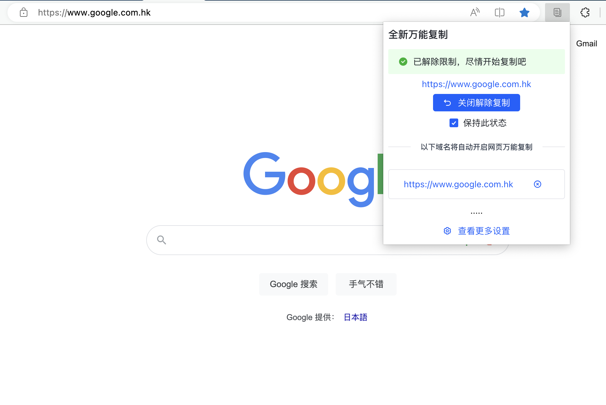
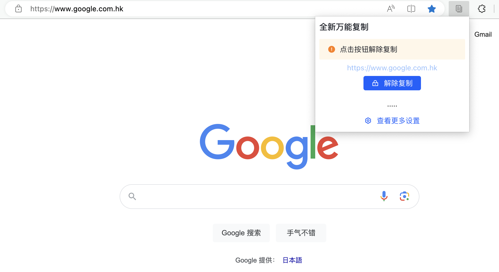
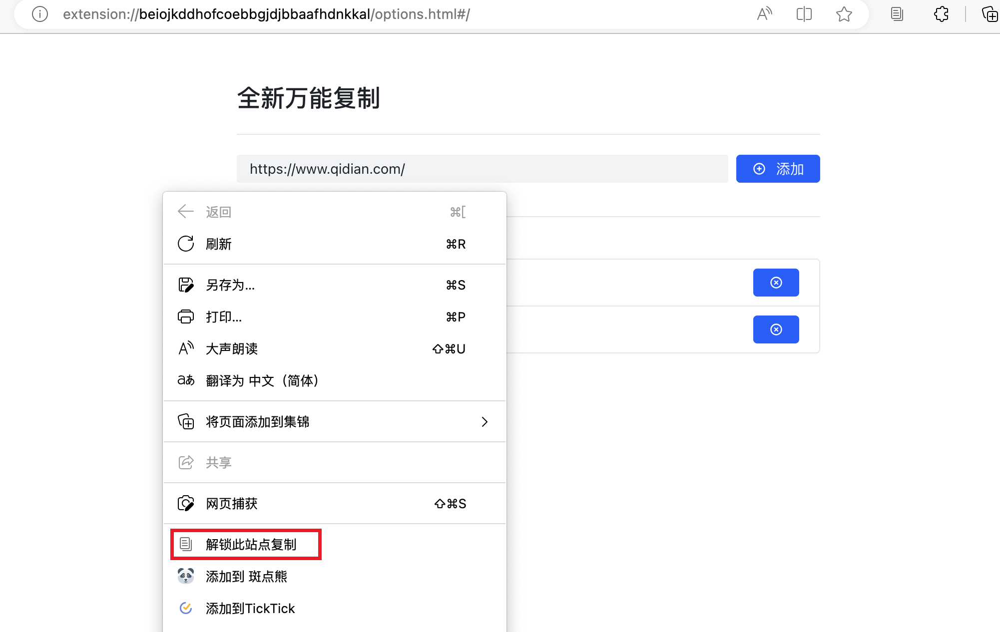
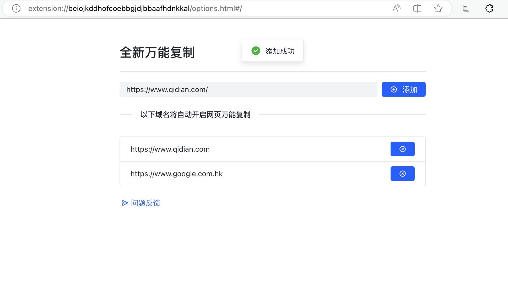

## 全新UI 改版万能复制

全新UI 改版万能复制

默认支持超 百家站点，支持自定义域名管理，更新及时，反馈及时

1、一键解锁禁止右键、选择、复制和粘贴功能，启用所有功能。
2、在限制复制、右键和选择的网站上使用最新的通用复制功能，轻松实现一键复制、一键粘贴和一键选择，并恢复所有原有功能

使用方法

- 点击右上角的图标，选择“解除复制”
- 在需要复制的网页上，按下Ctrl + C，即可复制
- 点击"保持此状态"，将自动记忆，下次访问时无感 "解除复制"
- 查看更多支持添加更多自定义域名

快捷键：
PC：
剪切：Ctrl + X
复制：Ctrl + C
粘贴：Ctrl + V

Mac：
剪切：Command + X
复制：Command + C
粘贴：Command + V

支持常用站点

如有不支持的站点可以在下方链接中填写一些信息，我们会尽快处理

https://wj.qq.com/s2/12630919/2802/

## 项目技术分析

- React + Arco + Twailcss

## 演示图

## 安装地址

https://microsoftedge.microsoft.com/addons/detail/%E5%85%A8%E6%96%B0%E4%B8%87%E8%83%BD%E5%A4%8D%E5%88%B6/kbodfokmnaoloacalfialggcadjcbgfm?hl=zh-CN